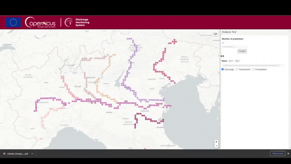

# Copernicus River Discharges Analysis
<p>
  
  
	
  
</p>

 <br><br>
Climate changes impact on river discharges within rivers level monitoring on variations in rainfall and temperatures related to the water availability. An analysis of precipitations and temperatures changes on the European rivers discharges in the past 10 years.

## Abstract 
This study proposes an application to visually analyze river discharge changes over the last ten years in the North of Italy. Rivers like Po and Adige are crucial to sustaining the Po valley's agriculture and food factories. Recent events argue about the rivers drying in some specific areas affected by high temperatures and low precipitations due to climate changes. The proposed analysis aims to study variations of temperatures, rainfall, and river discharges in some monitored locations on the entire courses of northern Italian rivers and try to focus on some causal dependencies or correlations to archive a prediction model implementation used in a final analysis application. 

## Demo Illustration
<p align="center">

</p><br>
The demo on the left shows a simulation of the final application to retrieves information and prediction about a specific location of one of the ten major italian river in the North of Italy. An end user needs to click on one of the marker and visualize filtered information retrieved from our system. Furthermore, can execute an offline or online prediction to the selected point.

## How to Run
The entire application runs on the a flask environment with Python 3.x; the final application in available online here. <br>
However, we have the possibility to run locally going to the /app directory and execute:
```
flask run
```
The server will start in a couple of minutes due to the large files loading. Be patient.

## Data Management and Analysis
Due to the large size of notebook, Github may have some problem with the preview mode, we suggest to download notebooks locally and visualize in a jupyter local runtime also available in some plugin editors like Visual Studio Code. 

## Contributors
- Francesco Biancucci (<a href="https://github.com/Prop4et">@Prop4et</a>)
- Mario Sessa (<a href="https://github.com/kode-git">@kode-git</a>)

## License
<p align="left">
© Apache License <br>
Version 2.0, January 2004  <br>
http://www.apache.org/licenses/  <br>
</p>
